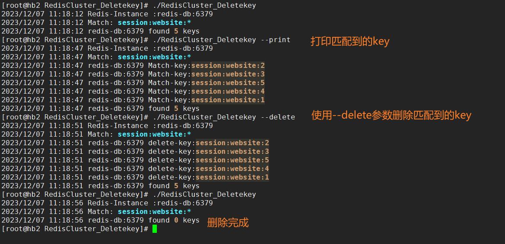
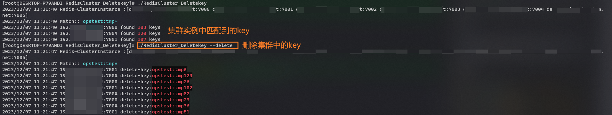

Redis key匹配删除工具，支持Redis单机和Redis集群模糊匹配删除。   
区别于使用`keys`命令匹配删除，工具使用`redis scan`进行匹配删除，这样删除不会对redis服务造成阻塞影响。  
Redis Cluster集群匹配删除会默认使用Master节点进行删除

`config.yml`示例配置文件
```yml
Redis: # redis单机版配置
  Addr: "redis-db-beijing:6379"
  Password: ""
  DB: 2  # 数据库
  Match: # 要删除的匹配key
    - "opstest:tmp*"
    - "tmp:*"
    - "ddn:userinfo:*"
Cluster: # redis集群版配置
  Addrs: #redis集群连接信息,不区分master slave 自动识别master
    - "redis-db-beijing1:7000"
    - "redis-db-beijing1:7001"
    - "redis-db-beijing2:7002"
    - "redis-db-beijing2:7003"
    - "redis-db-beijing3:7004"
    - "redis-db-beijing3:7005"
  Username: ""
  Password: "xxxxxxx"
  Match: # 要删除的匹配key
    - "opstest:tmp*"
    - "tmp:*"
    - "ddn:userinfo:*"
```
`config.yml`单机redis配置
```yml
Redis: # redis单机版配置
  Addr: "redis-db-beijing:6379"
  Password: ""
  DB: 2  # 数据库
  Match: # 要删除的匹配key
    - "opstest:tmp*"
    - "tmp:*"
    - "ddn:userinfo:*"
```
`config.yml` Redis集群配置
```yaml
Cluster: # redis集群版配置
  Addrs: #redis集群连接信息,不区分master slave 自动识别master
    - "redis-db-beijing1:7000"
    - "redis-db-beijing1:7001"
    - "redis-db-beijing2:7002"
    - "redis-db-beijing2:7003"
    - "redis-db-beijing3:7004"
    - "redis-db-beijing3:7005"
  Username: ""
  Password: "xxxxxxx"
  Match: # 要删除的匹配key
    - "opstest:tmp*"
    - "tmp:*"
    - "ddn:userinfo:*"
```

#### 工具使用

```shell
./RedisCluster_Deletekey --conf config.yml # 指定配置文件，可用来区分redis实例
./RedisCluster_Deletekey --print # 打印详细匹配到的key
./RedisCluster_Deletekey --delete #删除匹配到的key
```

#### 单机版删除效果


#### 集群版删除效果
